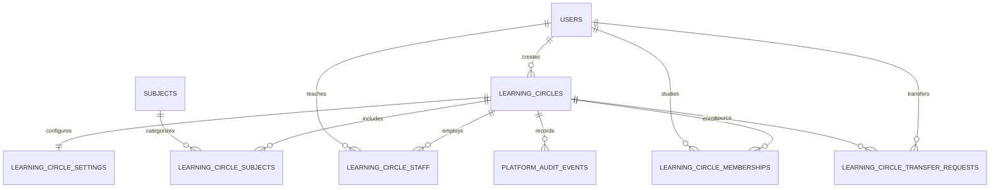

# نموذج بيانات الحلقات الموحد

الحالة: تصميم المرحلة الثانية، غير مطبق على الإنتاج.
Migration: `0011_learning_circles_core.sql`.

## القرار الهندسي

تبقى `halaqat` و`classrooms` والجداول التابعة لهما دون حذف أثناء الانتقال. تصبح `learning_circles` الطبقة المرجعية الجديدة، وتحمل الحلقة القديمة المعرف نفسه لتسهيل ربط التقارير والصفحات تدريجيا.

## الجداول

- `learning_circles`: الهوية والنوع والحالة ورابط Meet والربط الاختياري بالسجل القديم.
- `learning_circle_subjects`: مواد متعددة للحلقة، ويدعم توسع الحلقات التعليمية.
- `learning_circle_staff`: المسؤول والمساعدون والتفويضات التفصيلية وتاريخ انتهاء التكليف.
- `learning_circle_memberships`: عضويات الطلاب النشطة والمؤرشفة ومصدرها.
- `learning_circle_transfer_requests`: طلب نقل القرآن وقرار المدير.
- `learning_circle_settings`: النقاش والمنطقة الزمنية ومواعيد الفترات ونافذة الأعذار.
- `platform_audit_events`: سجل عام غير مخصص للمدير وحده، وتضاف سياسات ثباته في المرحلة الثالثة.

## القيود الحاكمة

1. مسؤول نشط واحد فقط لكل حلقة.
2. تكليف نشط واحد للمعلم داخل الحلقة.
3. عضوية نشطة أو قيد النقل واحدة للطالب داخل الحلقة.
4. عضوية قرآن نشطة واحدة للطالب على مستوى المنصة.
5. نوع العضوية ينسخ من الحلقة بخادم قاعدة البيانات ولا يقبل قيمة العميل.
6. السجلات المنتهية تحتفظ بتاريخ الانتهاء ولا تحذف.
7. طلب نقل معلق واحد فقط لكل طالب.

## التوافق والرجوع

- تنسخ الحلقات والفصول الحالية إلى النموذج الجديد باستخدام UUID نفسه.
- ينشأ المعلم القديم كمسؤول كامل الصلاحيات.
- تنسخ عضويات الطلاب الحالية كسجلات `legacy`.
- لا تعدل Migration أي سجل قديم ولا تحذف جدولا أو عمودا.
- الرجوع قبل استخدام الصفحات الجديدة ممكن بإسقاط الجداول الجديدة فقط؛ تبقى الواجهات القديمة قابلة للعمل.

## ما يؤجل للمرحلة الثالثة

- دوال الصلاحيات وRLS التفصيلية.
- اعتماد نقل الطالب كعملية ذرية.
- منع تغيير سجل التدقيق أو حذفه.
- التحقق الخادمي من رابط Google Meet.
- واجهات القراءة والكتابة المخصصة لكل دور.
